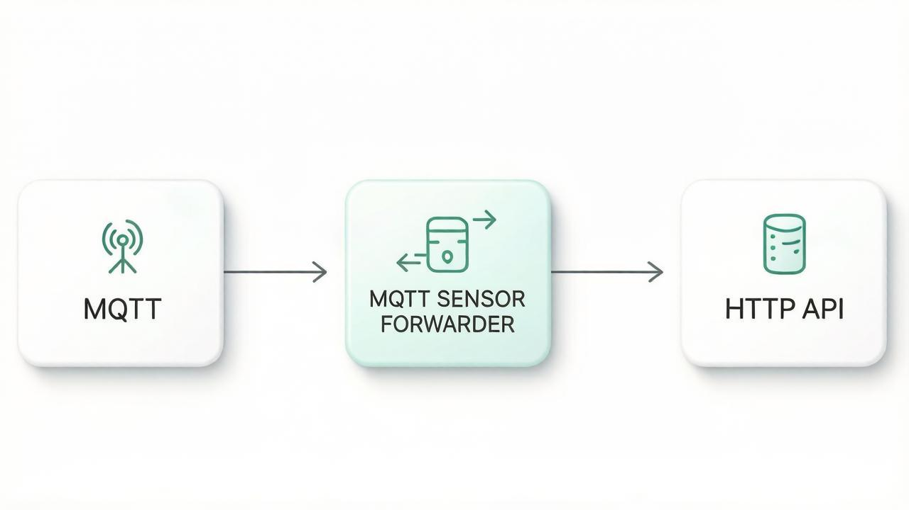

<div align="center">
  <h1>🚀 MQTT Sensor Forwarder</h1>
  <p>Простая и эффективная утилита для передачи данных с MQTT-брокера на внешний HTTP API.</p>
</div>


<div>
    
</div>
<div>
    <h2>Особенности:</h2>
    <ul>
        <li>Написана на языке Go, легковесная и производительная</li>
        <li>Поддержка многопоточности для параллельной обработки сообщений</li>
        <li>Не требует статического IP-адреса</li>
        <li>Легко настраиваемый автозагрузчик через cron</li>
        <li>Оптимизация для работы на платформе WirenBoard 6+</li>
        <li>Открытый исходный код и свободная лицензия</li>
    </ul>
</div>
<div>
    <h2>Зачем использовать:</h2>
    <ul>
        <li>Сбор и передача показаний датчиков в облачную инфраструктуру</li>
        <li>Создание собственных решений для умного дома и промышленного IoT</li>
        <li>Простота установки и настройки</li>
    </ul>
</div>
<div>
    <h2>🧭 Архитектура</h2>
    <p>MQTT → MQTT Sensor Forwarder → HTTP API</p>
</div>
<div>
    <h2>📂 Структура проекта</h2>

```
├── config.env                  # Переменные окружения
├── topic.json                  # Список MQTT-топиков
├── LICENSE                     # Лицензия
├── wb8                         # Скрипт
└── install_autostart.sh        # Устанавливает автозапуск Cron
```

</div>
<div>
    <h2>📥 Вариант 1: Скачать и подготовить проект</h2>

```bash
$ wget https://github.com/Clyckov34/MQTT_Sensor_Forwarder/releases/download/wb8-1.2.1/WB-8.zip
$ unzip WB-8.zip
$ cd WB-8
```

</div>
<div>
    <h2>🛠️ Вариант 2: Сборка</h2>

| Платформа          | Команда |
|--------------------|--------|
| Wiren Board (ARMv7) | `GOOS=linux GOARCH=arm GOARM=7 go build -o wb8 cmd/main.go` |
| Linux (x64)        | `go build -o wb8 cmd/main.go` |

</div>
<div>
    <h2>🔧 Настройка</h2>
    <h3>1. Настройка окружения</h3>
    <p>Откройте файл config.env и укажите параметры:</p>
    <ul>
        <li><code>SERVER</code> - Адрес сервера куда будут отправляться показания датчиков</li>
        <li><code>CONTROLLER_ID</code> - Идентификатор контроллера</li>
        <li><code>CLIENT_ID</code> - Почта клиента</li>
        <li><code>CLIENT_TOKEN</code> - Токен клиента</li>
        <li><code>MQTT_SERVER</code> - URL (IP) адрес MQTT cервера</li>
        <li><code>MQTT_PORT</code> - Порт MQTT-сервера</li>
        <li><code>MQTT_TOPIC_FILE</code> - Путь к файлу topic.json</li>
        <li><code>MQTT_USERNAME</code> - Логин MQTT-сервера <code>Дополнительное поле</code></li>
        <li><code>MQTT_PASSWORD</code> - Пароль MQTT-сервера <code>Дополнительное поле</code></li> 
    </ul>
</div>
<div>
    <h3>2. Настройка топиков</h3>
    <p>Файл topic.json содержит список топиков по которым будет подписываться:</p>

```json
{
  "topics": [
    {
      "path": "/devices/hwmon/controls/Board Temperature",
      "level_qos": 2
    },
    {
      "path": "/devices/hwmon/controls/CPU Temperature",
      "level_qos": 2
    }
  ]
}
```

</div>
<div>
    <h2>📡 QoS уровни</h2>

| Уровень   | Описание                                      |
| --------- | --------------------------------------------- |
| **QoS 0** | Максимум один раз (без гарантии доставки)     |
| **QoS 1** | Минимум один раз (возможны дубликаты)         |
| **QoS 2** | Ровно один раз (самый надёжный, но медленный) |

</div>
<div>
    <h2>▶️ Запуск</h2>
<p>Файл config.env загружается автоматически при запуске приложения.</p>    
<p>Запуск приложения</p>

```bash
./wb8
```

<p>Автозапуск приложения с помощью cron</p>

```bash
./install_autostart.sh
```

</div>
<div>
    <h2>📤 Формат отправляемых данных</h2>

```json
{
  "Server": "https://httpbin.org/post",
  "ClientID": "244235",
  "Token": "Wefefor34rmcfree22svFFE",
  "ControllerID": "000001",
  "SensorReadings": {
    "/devices/hwmon/controls/Board Temperature": 39.25,
    "/devices/hwmon/controls/CPU Temperature": 66.835,
    "/devices/sauna_floor_thermostat/controls/temperature": 31.9,
    "/devices/sauna_heater/controls/tempCurrent": 90.375,
    "/devices/sauna_heater_ssr/controls/tempSetpoint_ssr": 95,
    "/devices/wb-adc/controls/Vin": 50.26,
    "/devices/wb-m1w2_34/controls/External_Sensor_1": 13.3125,
    "/devices/wb-m1w2_34/controls/External_Sensor_2": 90.375,
    "/devices/wb-mr6cu_85/controls/MCU Temperature": 42.8,
    "/devices/wb-w1/controls/28-0000102149e4": 31.75,
    "/devices/wb-w1/controls/28-00001021f4a9": 32.187
  }
}

```

<h3>📌 Описание полей</h3>
<ul>
    <li><code>Server</code> — адрес API сервера</li>
    <li><code>ClientID</code> — email клиента</li>
    <li><code>Token</code> — токен авторизации</li>
    <li><code>ControllerID</code> — идентификатор устройства</li>
    <li><code>SensorReadings</code> — объект с данными датчиков
         <ul>
            <li>ключ — MQTT-топик</li>
            <li>значение — текущее значение датчика</li>
        </ul>
    </li> 
</ul>

</div>
<div>
    <h2>📜 Лицензия</h2>
    <p>MIT License</p>
</div>
